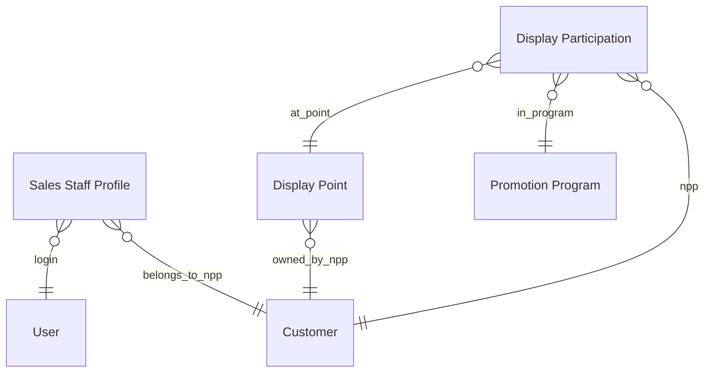

# DocType Blueprint — App `display_point`

App name: `display_point` | Module: `Display Point`

## ERD

---

## DocType 1: Sales Staff Profile (`sales_staff_profile`)
- **Naming**: field `full_name` (hoặc series `NV-.#####`) — dùng series để tránh trùng tên.
- **Naming series**: `NV-.#####`
- **Track Changes**: Yes
- **Image Field**: `profile_photo`
- **Title Field**: `full_name`
- **Search Fields**: `full_name,phone,distributor`

#### Fields
| Fieldname | Label | Type | Options | Reqd | Notes |
|---|---|---|---|---|---|
| user | Tài khoản | Link | User | ✓ | unique, dùng đăng nhập portal |
| full_name | Họ tên | Data | | ✓ | |
| phone | Số điện thoại | Data | | ✓ | |
| cccd | CCCD | Data | | | dữ liệu thường (mày chốt bỏ permlevel) |
| distributor | NPP trực thuộc | Link | Customer | ✓ | |
| profile_photo | Ảnh đại diện | Attach Image | | | |
| bank_account_name | Tên chủ TK | Data | | | |
| bank_account_no | Số TK | Data | | | |
| bank_name | Ngân hàng | Data | | | |

#### Notes
- Khi NVBH tạo Display Point/Participation, `distributor` fetch_from profile → NV không chọn NPP thủ công.

---

## DocType 2: Display Point (`display_point`) — MASTER, bền vững
- **Naming series**: `DP-.YYYY.-.#####`
- **Track Changes**: Yes
- **Image Field**: `store_photo`
- **Title Field**: `point_name`
- **Search Fields**: `point_name,phone,distributor`
- **Is Submittable**: No (master, không workflow ở đây)

#### Fields
| Fieldname | Label | Type | Options | Reqd | Notes |
|---|---|---|---|---|---|
| point_name | Tên điểm | Data | | ✓ | |
| distributor | NPP | Link | Customer | ✓ | fetch từ profile NVBH |
| phone | SĐT điểm | Data | | ✓ | **khoá chống trùng** (validate unique) |
| address_line | Địa chỉ | Small Text | | ✓ | |
| latitude | Vĩ độ | Float | | | |
| longitude | Kinh độ | Float | | | |
| gps_accuracy | Sai số GPS (m) | Float | | | cảnh báo nếu > 100 |
| store_photo | Ảnh cửa hàng (chung) | Attach Image | | ✓ | dùng lại qua các chương trình |
| bank_account_name | Tên chủ TK | Data | | | TK chủ điểm nhận thưởng |
| bank_account_no | Số TK | Data | | | |
| bank_name | Ngân hàng | Data | | | |
| is_active | Đang hoạt động | Check | | | default 1 |

#### Relationships
- Links to: Customer (NPP)
- Linked from: Display Participation (N lượt tham gia)

---

## DocType 3: Promotion Program (`promotion_program`)
- **Naming series**: `CT-.YYYY.-.###`
- **Title Field**: `program_name`
- **Search Fields**: `program_name,status`

#### Fields
| Fieldname | Label | Type | Options | Reqd | Notes |
|---|---|---|---|---|---|
| program_name | Tên chương trình | Data | | ✓ | |
| start_date | Bắt đầu | Date | | ✓ | |
| end_date | Kết thúc | Date | | ✓ | |
| budget | Ngân sách | Currency | | | |
| reward_per_point | Thưởng/điểm | Currency | | | dùng tính chi phí đã dùng |
| target_points | Mục tiêu số điểm | Int | | | cho dashboard tiến độ |
| status | Trạng thái | Select | Nháp\nĐang chạy\nKết thúc | | |
| description | Mô tả | Text Editor | | | |

---

## DocType 4: Display Participation (`display_participation`) — TRANSACTION
- **Naming series**: `DPT-.YYYY.-.#####`
- **Track Changes**: Yes (lịch sử sửa sau duyệt)
- **Image Field**: `display_photo`
- **Title Field**: (expression) point + program
- **Search Fields**: `display_point,promotion_program,workflow_state`
- **Workflow**: Có (xem file 04)

#### Fields
| Fieldname | Label | Type | Options | Reqd | Notes |
|---|---|---|---|---|---|
| display_point | Điểm bán | Link | Display Point | ✓ | chọn điểm có sẵn hoặc tạo mới |
| promotion_program | Chương trình | Link | Promotion Program | ✓ | |
| distributor | NPP | Data/Link | Customer | | fetch_from display_point.distributor |
| display_photo | Ảnh trưng bày (riêng) | Attach Image | | ✓ | ảnh của đợt chương trình này |
| latitude | Vĩ độ lúc chấm | Float | | | |
| longitude | Kinh độ lúc chấm | Float | | | |
| gps_accuracy | Sai số GPS | Float | | | |
| workflow_state | Trạng thái duyệt | Select | (workflow) | | Nháp/Chờ duyệt/Đã duyệt/Từ chối |
| reject_reason | Lý do từ chối | Small Text | | | depends_on Từ chối |
| approved_by | Người duyệt | Link | User | | set tự động khi duyệt |
| approved_on | Ngày duyệt | Datetime | | | |

#### Ràng buộc nghiệp vụ
- **Unique** theo cặp (`display_point`, `promotion_program`): 1 điểm chỉ tham gia 1 chương trình 1 lần.
- Sau "Đã duyệt": cho sửa, chặn `on_trash` (không xoá). Mọi sửa ghi version (track_changes).
- Chống trùng điểm: nằm ở Display Point (SĐT). Participation chỉ trỏ link.
